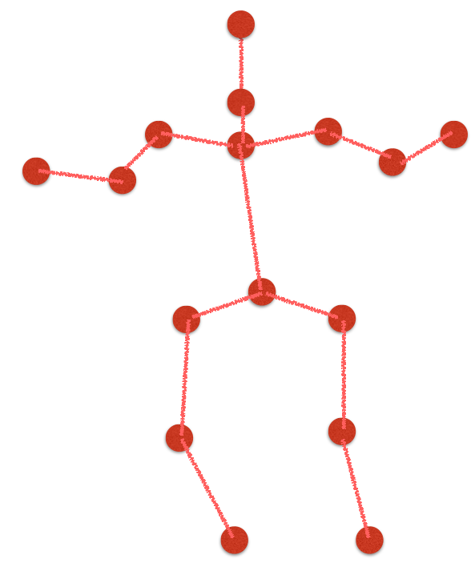
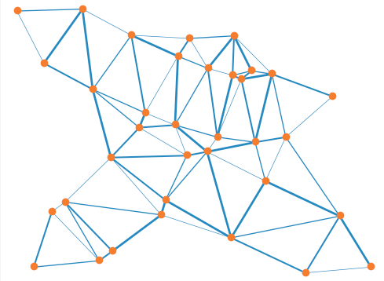
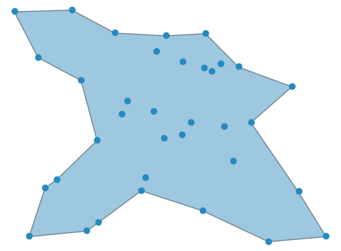
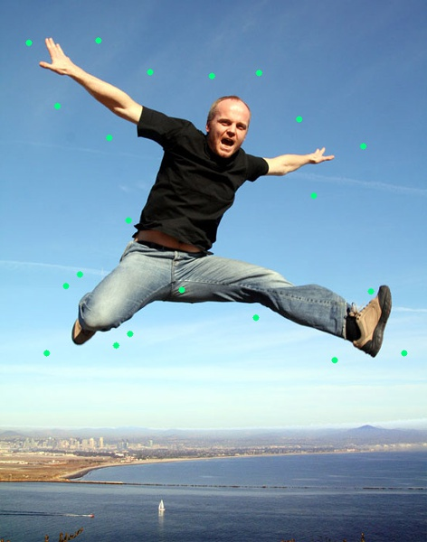
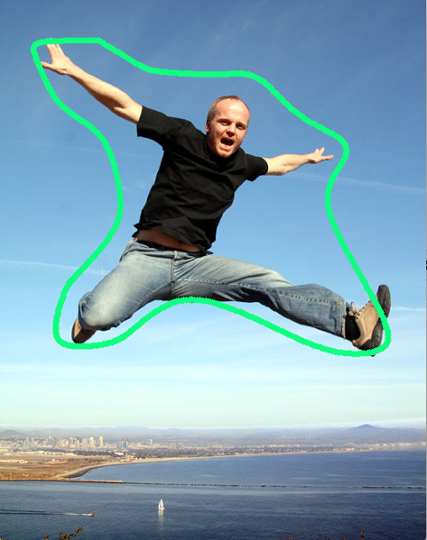

# Nature-Cut-Out

This is the python implementation of cutting out a nature contour aroung human body.

## Result

I've tested on several images and in most cases the results work pretty well.

<div align="center">


</div>

<div align="center">


</div>

<div align="center">


</div>

## Setup

Recommended running environment:
* Mac OS X El Capitan (version 10.11.6) 
* Python 3.6.1

Library:
* OpenCV 3.3.0-rc
* Scipy 0.19.1
* Shapely 1.5.17
* math
* Numpy 1.13.1
* Bezier

Optional library:
* descartes
* matplotlib

Using pip to install all these library would be recommended:
```
pip install the-lib-you-want-to-install
```
Also, if you stuck in some problems when installing OpenCV with Python bindings, I will recommend following [this tutorial](http://www.pyimagesearch.com/2016/12/05/macos-install-opencv-3-and-python-3-5/) written by [Adrian Rosebrock](http://www.pyimagesearch.com/author/adrian/).

## Usage
### 1. Easy Way (preview using Jupyter Notebook)
First clone the current repo :
```
git clone https://github.com/w102060018w/Nature-Cut-Out.git
```

(Required)Follow the github repository for installing caffe-opencv-CUDA8.0-docker in **[here](https://github.com/w102060018w/caffe-opencv-cuda8.0-docker)**.

After starting the Container using Docker, go into the container, switch to the directory and we can run the code.
```
cd /auto-cutout/

jupyter-notebook --ip=0.0.0.0 --allow-root

```

On the pop out Jupyter Notebook browser, go to the **/testing/python** directory and select **demo_testing.ipynb** and run all cells, you can see the result in the very bottom.


### 2. Hard Way
#### Basic usage:
```
python HPE_NatureCutout.py
```
It will run 27 images in the **./input** folder at one time, and show an output image once at a time, press 'esc' to see next output image.

#### Output:

Output will all be saved to the **./New_Output** folder. Each input will generate 3 outputs, including the result simple base on Human-Pose-Estimation, the result after applying Alpha-Shape and the result after using 4-point Bézier curve.

<div align="center">


</div>
<div align="center">


</div>


#### Run on your own images:

Please first go to [this website](https://fling.seas.upenn.edu/~xiaowz/dynamic/wordpress/shapeconvex/) and scroll down to the bottom to download the matlab code on constructing 2D and 3D human pose. Save the 2D human pose result as the **.mat** file:
```
filename = 'testImg21'
fname = strcat('./pred_2d',filename(8:end));
save(fname,'preds_2d');
```
which 'preds_2d' is the parameter's name.

Put both your .mat files and images in the input folder, and make sure the format and the name of files are the same as mine in the input folder. 

## Algorithm
The whole process could be divided into the following process:

**1. First using 2D human pose estimation to get the landmarks of a human body.**

Big thanks to the great work done by X. Zhou, M. Zhu, S. Leonardos, K. Daniilidis., Download the code from the [website](https://fling.seas.upenn.edu/~xiaowz/dynamic/wordpress/shapeconvex/).
* generate heatmap in advance:

```
th ./pose-hg-demo/run-hg.lua
```

* run the matlab code to get the 16 landmarks(shown in right most image):

<div align="center">


</div>

**2. Base on 2D landmarks, calculate those possible contour points.**

Base on the vector constructed between 2 landmarks, calculate its norm direction and mark out these points(green points in the concept figure) as the possible contour points.
The following are the concept figure:
	<div align="center">
	
	
	
	
	</div>

The result on the above example image would be just like:
	<div align="center">
	
	
	</div>

**3. Apply [alpha shape](https://en.wikipedia.org/wiki/Alpha_shape) to find out those key points which will contribute to build the contour.**

Thanks to the clear tutorial by [Sean Gillies](https://sgillies.net/2012/10/13/the-fading-shape-of-alpha.html) and [KEVIN DWYER](http://blog.thehumangeo.com/2014/05/12/drawing-boundaries-in-python/), you can click the links to look into detail. My alpha shape function is mainly built on the code shown in the above two links.

The whole concept is first build [delaunay triangulation](https://en.wikipedia.org/wiki/Delaunay_triangulation) base on [SciPy library](https://docs.scipy.org/doc/scipy-0.14.0/reference/generated/scipy.spatial.Delaunay.html), and apply alpha-shape to remain those vetexes whose triangle's radius of the [circumcircle](http://www.mathopenref.com/trianglecircumcircle.html) is small enough. Finally we can extract all these points as the control points to build a smooth contour later on.

The following pictures are the result from step 2, Delaunay-triangle, Alpha-shape and the exterior points of the alpha shape respectively.

<div align="center">




</div>


**4. Interpolating between key points and apply 4-point [Bézier curve](https://en.wikipedia.org/wiki/B%C3%A9zier_curve) to reconstruct the nature-cut-out.**

First interpolate 30 points between two neighbor points, and use the [bezier-function](https://bezier.readthedocs.io/en/latest/reference/bezier.html) in python package to reconstruct a more smooth contour. 

The following pictures are the result from step 3, the result after interpolation and the result after applying bezier curve shown in 100 points and 500 points, respectively.

<div align="center">



</div>

## Acknowledgments
Thanks to the amazing work of human pose estimation model:
* [3D Shape Estimation via Convex Optimization](https://fling.seas.upenn.edu/~xiaowz/dynamic/wordpress/shapeconvex/) 
* [Realtime Multi-Person Pose Estimation](https://github.com/w102060018w/Realtime_Multi-Person_Pose_Estimation)
Thanks to the nice tutorial of alpha shape:
* [Sean Gillies](https://sgillies.net/2012/10/13/the-fading-shape-of-alpha.html)
* [KEVIN DWYER](http://blog.thehumangeo.com/2014/05/12/drawing-boundaries-in-python/)
