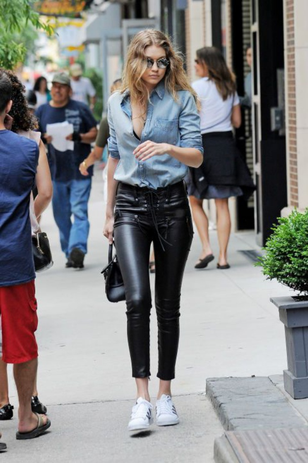
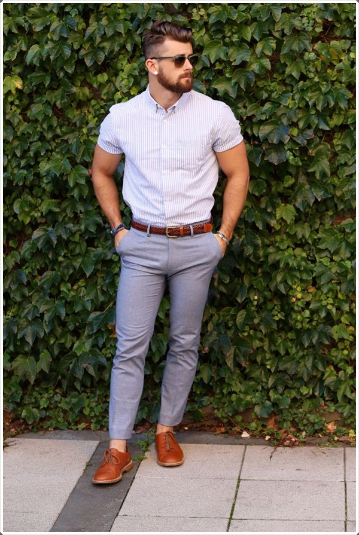
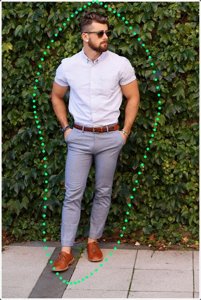
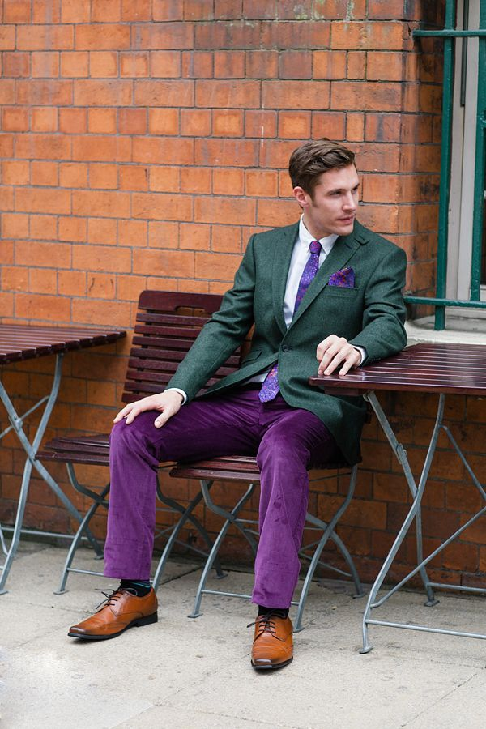
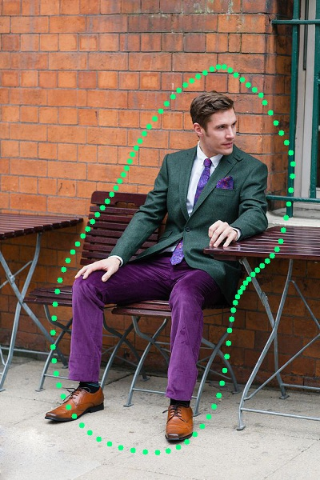
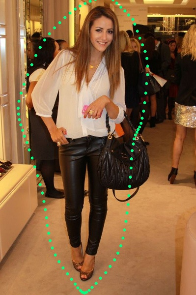
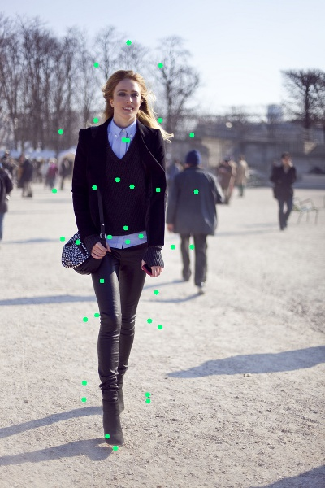
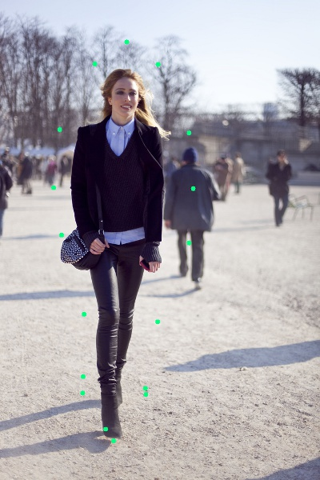
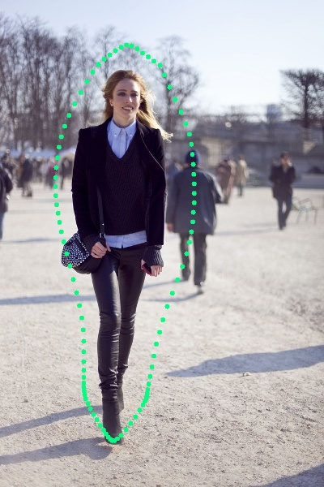

# Nature-Cut-Out

This is the python implementation of cutting out a nature contour aroung human body.

## Result

I've tested on several images and in most cases the results work pretty well.

<div align="center">




</div>

<div align="center">




</div>

<div align="center">



</div>

## Setup

Recommended running environment:
* Mac OS X El Capitan (version 10.11.6) 
* Python 3.6.1

Library:
* OpenCV 3.3.0-rc
* Scipy 0.19.1
* Shapely 1.5.17
* math
* Numpy 1.13.1
* Bezier

Optional library:
* descartes
* matplotlib

Using pip to install all these library would be recommended:
```
pip install the-lib-you-want-to-install
```
Also, if you stuck in some problems when installing OpenCV with Python bindings, I will recommend following [this tutorial](http://www.pyimagesearch.com/2016/12/05/macos-install-opencv-3-and-python-3-5/) written by [Adrian Rosebrock](http://www.pyimagesearch.com/author/adrian/).

## Usage
**Basic usage**:
```
python HPE_NatureCutout.py
```
It will run 27 images in the ./input/ folder at one time, and show an output image once at a time, press 'esc' to see next output image.

**output**:

Output will all be saved to the ./New_Output/ folder. Each input will generate 3 outputs, including the result simple base on Human-Pose-Estimation, the result after applying Alpha-Shape and the result after using 4-point Bézier curve.

<div align="center">



</div>
<div align="center">


</div>

**Run on your owm images**:
I am still working on, since currently I use the
